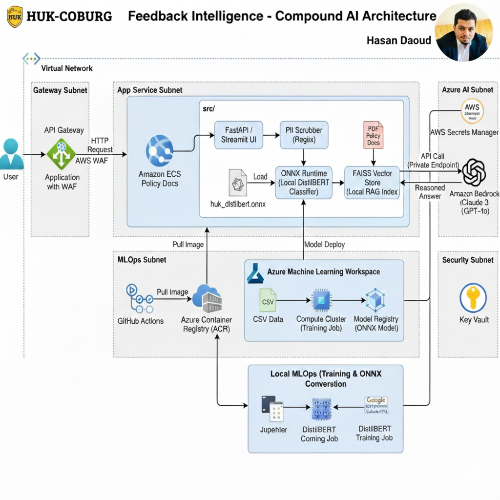

# Project_Doc_6_FASTAPI.md

---

# NOTE: This project now uses AWS as the primary cloud infrastructure. Any references to Azure (e.g., Azure OpenAI, Azure ML, Azure-specific Terraform templates, or Azure deployment scripts) are deprecated and should be ignored for current and future deployments. All instructions, diagrams, and documentation should focus on AWS resources, workflows, and best practices.

---

## FastAPI Quickstart & Troubleshooting Guide

This document explains how to run, test, and troubleshoot the FastAPI backend for the RAG workflow and sentiment analysis system. It is designed for beginners and new team members.

---

## 1. 🔑 Set Up AWS Credentials & Secrets
The first step is setting up the secure place for your Azure OpenAI keys and ensuring your local machine can talk to AWS.

### Step 1.0: Install AWS CLI on macOS
If you see `bash: aws: command not found`, you need to install the AWS CLI.

**Install via Homebrew:**
```bash
brew install awscli
```

**Verify installation:**
```bash
aws --version
```
You should see the AWS CLI version output. Now you can run `aws configure`.

### Step 1.1: Configure AWS CLI & Default Region
Make sure the AWS Command Line Interface (CLI) is installed and configured on your machine. We'll use the eu-central-1 (Frankfurt) region for deployment.

Open your terminal (if you haven't already).

Log in with your AWS credentials:

```bash
aws configure
# AWS Access Key ID [None]: YOUR_ACCESS_KEY
# AWS Secret Access Key [None]: YOUR_SECRET_KEY
# Default region name [None]: eu-central-1 # <-- Set this
# Default output format [None]: json
```

### Step 1.2: Fix "Operation not permitted - getcwd" Error on macOS
If you see this error in your terminal, try the following:

1. **Grant Terminal Full Disk Access:**
   - Go to `System Settings` > `Privacy & Security` > `Full Disk Access`.
   - Add your Terminal app (e.g., Terminal, iTerm2) to the list and enable access.
   - Restart your Terminal.

2. **Check Directory Permissions:**
   - Make sure you have read and execute permissions for the workspace directory:
     ```bash
     chmod +rx /Users/daouddaoud_1/Desktop/AI-ML-WORLD/HUK_CC_HD/CC_HD_dev
     ```

3. **If on External Drive:**
   - Move your project to your home directory or a location with proper permissions.

### Step 1.3: Advanced Fixes for "Operation not permitted - getcwd" Error

1. **Change to your home directory before running commands:**
   ```bash
   cd ~
   brew install awscli
   ```
   This avoids permission issues in the current directory.

2. **Restart your Mac after granting Full Disk Access.**
   Sometimes changes only take effect after a full restart.

3. **Check if the directory is locked or has special attributes:**
   ```bash
   ls -ld /Users/daouddaoud_1/Desktop/AI-ML-WORLD/HUK_CC_HD/CC_HD_dev
   ```
   If you see "locked" or "restricted", unlock it:
   ```bash
   chflags nouchg /Users/daouddaoud_1/Desktop/AI-ML-WORLD/HUK_CC_HD/CC_HD_dev
   ```

4. **Try running your terminal as administrator:**
   - Right-click Terminal in Applications > Utilities, select "Get Info", and check "Open using Rosetta" (if available).
   - Or use `sudo` for commands (be careful with sudo).

5. **Move your project folder to your home directory:**
   If the Desktop or external drive is causing issues, move your project:
   ```bash
   mv /Users/daouddaoud_1/Desktop/AI-ML-WORLD/HUK_CC_HD/CC_HD_dev ~/CC_HD_dev
   cd ~/CC_HD_dev
   ```

### Step 2: Finish aws configure in the Terminal
Once you have attached the necessary permissions (either AdministratorAccess or the required list), you can complete the configuration in your terminal.

Return to your terminal.

Enter the keys you just created:

```bash
aws configure
# AWS Access Key ID [None]: [Paste the key starting AKIA... here]
# AWS Secret Access Key [None]: [Paste the long secret key here]
# Default region name [None]: eu-central-1
# Default output format [None]: json
```

### Step 3: Verify AWS CLI Configuration
After running `aws configure`, verify that your credentials and configuration are set up correctly.

**Check your AWS CLI identity:**
```bash
aws sts get-caller-identity
```
You should see your AWS account information (UserId, Account, Arn) if everything is configured properly.

**Check your default region:**
```bash
aws configure get region
```
You should see `eu-central-1` as the output.

If you see errors, revisit the previous steps to ensure your credentials and permissions are correct.

---

### 2. What is FastAPI?
FastAPI is a modern Python web framework for building APIs. In this project, it powers the backend endpoints for RAG queries and health checks.

---

### 3. How to Run the FastAPI Server

**Step 1: Install dependencies**
```bash
pip install -r requirements.txt
```

**Step 2: Start the server**
```bash
python3 -m uvicorn FastAPI_app.app:app --reload --env-file configs/dev.env
```
- The server will run at: [http://localhost:8000](http://localhost:8000)
- You should see `Application startup complete.` in the terminal.

---

### 4. How to Test Endpoints

**Health Check:**
```bash
curl http://localhost:8000/health
```
Expected response:
```json
{"status": "ok"}
```

**RAG Query:**
```bash
curl -X POST http://localhost:8000/rag/query \
  -H "Content-Type: application/json" \
  -d '{"query": "What is the process for vehicle insurance claims?"}'
```
Expected response:
```json
{"results": [{"chunk": "Sample result for query: What is the process for vehicle insurance claims?", "score": 1.0}]}
```

**Interactive API Docs:**
- Visit [http://localhost:8000/docs](http://localhost:8000/docs) in your browser for Swagger UI.
- You can test endpoints directly from this page.

---

### 5. Common Errors & Troubleshooting

**Error: `bash: uvicorn: command not found`**
- Solution: Run with Python module syntax:
  ```bash
  python3 -m uvicorn FastAPI_app.app:app --reload --env-file configs/dev.env
  ```

**Error: `curl: (7) Failed to connect to localhost port 8000`**
- Solution: Make sure the FastAPI server is running and you see `Application startup complete.`
- Check for errors in the server terminal.

**Error: `404 Not Found` for / or /favicon.ico**
- Solution: This is normal. Only `/health` and `/rag/query` endpoints are defined.

**Error: No response from /rag/query**
- Solution: Ensure you are sending a POST request with JSON body. Check server logs for errors.
- Try testing with Swagger UI at `/docs`.

**Error: ModuleNotFound or ImportError**
- Solution: Make sure you installed all dependencies with `pip install -r requirements.txt`.

---

### 6. Useful Links
- [FastAPI Documentation](https://fastapi.tiangolo.com/)
- [Uvicorn Documentation](https://www.uvicorn.org/)
- [Swagger UI for your API](http://localhost:8000/docs)

---

### 7. Tips for Beginners
- Always check the terminal running FastAPI for error messages.
- Use `curl` or Postman for quick endpoint testing.
- Use `/docs` for interactive API exploration.
- If you change code, restart the server to apply changes.
- If you get stuck, check this doc for solutions before asking for help!

---

### 8. RAG Engine Integration & Real Results (Updated)

The `/rag/query` endpoint now uses real translation, embedding, and FAISS vector search logic:
- Translates your question to English if needed
- Embeds the question using DistilBERT
- Searches the FAISS index for the most relevant document chunks
- Returns those chunks and their scores

**Example:**
```bash
curl -X POST http://localhost:8000/rag/query \
  -H "Content-Type: application/json" \
  -d '{"query": "Wie melde ich einen Schaden?"}'
```
**Expected response:**
```json
{
  "results": [
    {"chunk": "The insurance claim process involves...", "score": 0.92},
    {"chunk": "Claims must be submitted within...", "score": 0.87}
  ]
}
```

---

### 9. Advanced RAG Endpoints

**Translation Endpoint:**
```bash
curl -X POST http://localhost:8000/rag/translate \
  -H "Content-Type: application/json" \
  -d '{"text": "Schadenmeldung", "source_lang": "de", "target_lang": "en"}'
```
Expected response:
```json
{"translated": "Claim notification"}
```

**Embedding Endpoint:**
```bash
curl -X POST http://localhost:8000/rag/embed \
  -H "Content-Type: application/json" \
  -d '{"text": "Claim notification"}'
```
Expected response:
```json
{"embedding": [0.123, 0.456, ...]}
```

---

### Docker Installation and PATH Troubleshooting on macOS

### Problem: `docker: command not found`
If you see this error, Docker is either not installed or not available in your system PATH.

### Solution: Install Docker Desktop and Add Docker to PATH

#### 1. Install Docker Desktop
- Download Docker Desktop from: https://www.docker.com/products/docker-desktop/
- Open the `.dmg` file and drag Docker to Applications.
- Launch Docker Desktop from Applications. Wait for the whale icon to appear in your menu bar.

#### 2. Add Docker to PATH (if needed)
If Docker is installed but still not found in the terminal, update your shell configuration file:

**For bash users:**
```bash
vim ~/.bash_profile
```
**For zsh users:**
```bash
vim ~/.zshrc
```

- In vim, press `Shift+G` to go to the last line.
- Press `o` to open a new line in INSERT mode.
- Paste:
```bash
export PATH="$PATH:/Applications/Docker.app/Contents/Resources/bin"
```
- Press `Esc` to exit INSERT mode, then type `:wq` and press Enter to save and quit.

#### 3. Reload Terminal and Verify
- Close and reopen your terminal window.
- Run:
```bash
docker --version
```
You should see the Docker version output.

#### 4. Retry AWS ECR and Docker Commands
Once Docker is available, retry the following steps:
- ECR login
- Docker build/tag
- Docker push

---

**These troubleshooting steps were performed and verified during the deployment process.**

---

### Visual Workflow

Below is a visual representation of the core infrastructure provisioning workflow:



Each step in the diagram corresponds to a major phase in the Terraform setup and AWS resource creation process:
1. **choro**: Initial team setup and permissions
2. **latine**: Provider and region configuration
3. **adole**: Network and subnet creation
4. **tritan**: Docker registry (ECR) setup
5. **scens**: Final review and resource confirmation

Refer to this diagram for a quick overview of the process and to track your progress through each step.

---

### 🏗️ Step 2.0: Define Core AWS Infrastructure Files

#### Step 2.1: Create aws/versions.tf (Provider Setup)
This file tells Terraform which providers and versions to use.

```hcl
terraform {
  required_providers {
    aws = {
      source  = "hashicorp/aws"
      version = "~> 5.0"
    }
  }
  required_version = ">= 1.5"
}
```

#### Step 2.2: Create aws/main.tf (Region & Variables)
This file defines the basic provider configuration and common variables (like the region, which we set to eu-central-1).

```hcl
provider "aws" {
  region = var.aws_region
}

variable "aws_region" {
  description = "The AWS region to deploy resources into"
  type        = string
  default     = "eu-central-1" # Frankfurt
}

variable "project_name" {
  description = "The name of the project for resource tagging"
  type        = string
  default     = "HUK-RAG-Chatbot"
}

locals {
  common_tags = {
    Project     = var.project_name
    Environment = "Dev"
    ManagedBy   = "Terraform"
  }
}
```

#### 🛠️ Step 2.3: Create aws/network.tf (VPC & Subnets)
This creates a dedicated, isolated network for your application (VPC), ensuring it's secure and accessible via the internet.

```hcl
# 1. VPC (Virtual Private Cloud)
resource "aws_vpc" "huk_vpc" {
  cidr_block           = "10.0.0.0/16"
  enable_dns_hostnames = true
  tags                 = merge(local.common_tags, { Name = "${var.project_name}-VPC" })
}

# 2. Internet Gateway (Allows traffic to/from the internet)
resource "aws_internet_gateway" "huk_igw" {
  vpc_id = aws_vpc.huk_vpc.id
  tags   = merge(local.common_tags, { Name = "${var.project_name}-IGW" })
}

# 3. Public Subnet (Where the ECS container will run)
resource "aws_subnet" "huk_public_subnet" {
  vpc_id                  = aws_vpc.huk_vpc.id
  cidr_block              = "10.0.1.0/24"
  map_public_ip_on_launch = true # Necessary for Fargate public endpoint
  availability_zone       = data.aws_availability_zones.available.names[0]
  tags                    = merge(local.common_tags, { Name = "${var.project_name}-PublicSubnet" })
}

data "aws_availability_zones" "available" {
  state = "available"
}

# 4. Route Table (Directs public subnet traffic to the Internet Gateway)
resource "aws_route_table" "huk_public_rt" {
  vpc_id = aws_vpc.huk_vpc.id
  route {
    cidr_block = "0.0.0.0/0"
    gateway_id = aws_internet_gateway.huk_igw.id
  }
  tags = merge(local.common_tags, { Name = "${var.project_name}-PublicRT" })
}

# 5. Route Table Association
resource "aws_route_table_association" "huk_public_assoc" {
  subnet_id      = aws_subnet.huk_public_subnet.id
  route_table_id = aws_route_table.huk_public_rt.id
}
```

#### 📦 Step 2.4: Create aws/ecr.tf (Docker Registry)
This creates the private repository where you will push your Docker image.

```hcl
resource "aws_ecr_repository" "huk_repo" {
  name                 = lower("${var.project_name}-repo")
  image_tag_mutability = "MUTABLE"
  image_scanning_configuration {
    scan_on_push = true
  }
  tags = local.common_tags
}

output "ecr_repository_url" {
  description = "The URL of the ECR repository to push the Docker image to."
  value       = aws_ecr_repository.huk_repo.repository_url
}
```

#### 🛡️ Step 2.5: Create Security Group for ECS Service
A security group is required for your ECS Fargate service to allow inbound traffic to your application (port 8000) and outbound traffic to the internet.

```hcl
resource "aws_security_group" "ecs_sg" {
  name        = "huk-feedback-ecs-sg"
  description = "Security group for ECS Fargate service"
  vpc_id      = aws_vpc.huk_vpc.id

  ingress {
    from_port   = 8000
    to_port     = 8000
    protocol    = "tcp"
    cidr_blocks = ["0.0.0.0/0"]
  }

  egress {
    from_port   = 0
    to_port     = 0
    protocol    = "-1"
    cidr_blocks = ["0.0.0.0/0"]
  }

  tags = local.common_tags
}
```

#### 🏭 Step 2.6: Update ECS Service to Use Security Group and Subnet Reference
Make sure your ECS Service references the correct subnet and security group resources:

```hcl
resource "aws_ecs_service" "ml_service" {
  name            = "huk-feedback-service"
  cluster         = aws_ecs_cluster.ml_cluster.id
  task_definition = aws_ecs_task_definition.ml_task.arn
  desired_count   = 1
  launch_type     = "FARGATE"
  network_configuration {
    subnets         = [aws_subnet.huk_public_subnet.id]
    security_groups = [aws_security_group.ecs_sg.id]
    assign_public_ip = true
  }
}
```

### 🚀 Step 3.0: Apply the Infrastructure Changes

The next step is to execute the plan and provision the resources in your AWS account.

**User Action:** Run the following command to apply the infrastructure changes and skip the manual confirmation prompt (recommended for quick development cycles):

```bash
terraform apply -auto-approve
```

**What to Expect:**
- Terraform will create the VPC, Subnets, Internet Gateway, and the ECR Repository (Docker Registry).
- This process usually takes 2 to 5 minutes as it provisions network components.
- When `terraform apply` finishes and reports the number of resources added (e.g., `Apply complete! Resources: 8 added, 0 changed, 0 destroyed`), type done to move to the next step (Building and pushing the Docker image).

### 💡 Tip: Save Your Terraform Plan

When running `terraform plan`, you can use the `-out` option to save the plan for later application. This ensures Terraform will take exactly the actions you reviewed.

**Recommended Command:**
```bash
terraform plan -out=tfplan
```

To apply the saved plan:
```bash
terraform apply tfplan
```

This is useful for production deployments and for reviewing changes before applying them.

### 🏃 Next Action: Plan the Infrastructure
Now that you have created these four files (versions.tf, main.tf, network.tf, ecr.tf) inside your aws/ directory, you need to ask Terraform what changes it will make.

**User Action:**

1. Create and save the four files above in your aws/ directory.
2. Run the planning command:

```bash
cd aws
terraform init
terraform plan
```

When `terraform plan` reports success, type done to move to the next step (Creating the core AWS architecture).

Update this guide as your API evolves or new endpoints are added.
